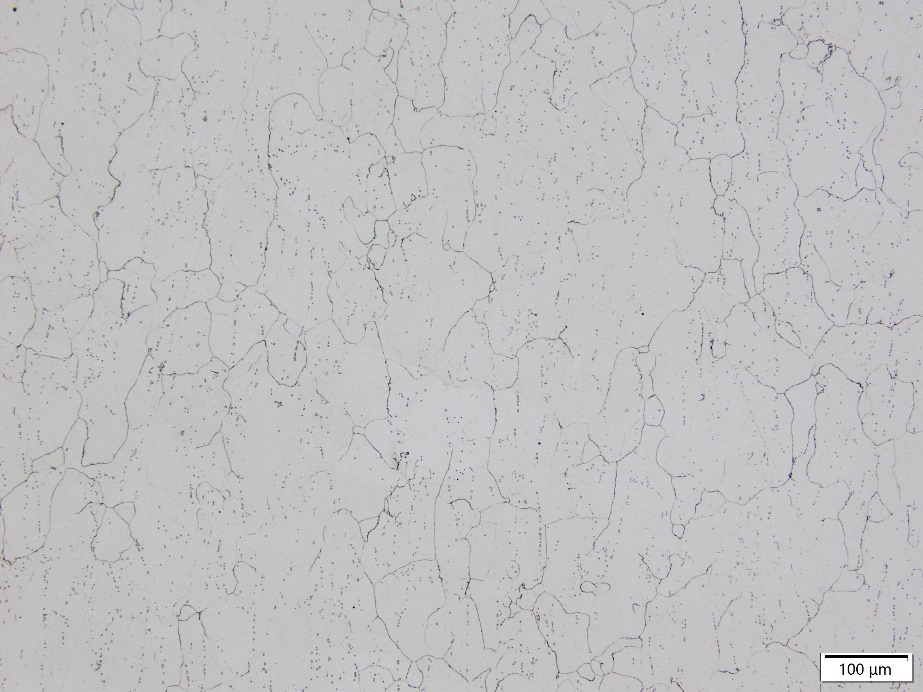

# GH3536金属粉末

PDS-002-1 GH3536金属粉末

## 介绍

GH3536是一款主要用铬和钼固溶强化、铁量较高的镍基奥氏体高温合金。
化学成分与美宇航标准AMS 5754、美标ASTM B572 UNS N06002、GB/T14992-2005、HastelloyX接近。

### 性能

- 良好的抗氧化和耐腐蚀性能。
- 在900℃以下有中等到的持久和蠕变强度。
- 冷、热加工成形性和焊接性能良好。
- 900℃以下长期使用，短时工作温度达到1080℃。在 600～1200℃高温下能承受一定应力并具有抗氧化或抗腐蚀能力的合金。
- 耐渗碳、渗氮环境。

### 典型应用

- 航空航天（燃烧室、整流器、结构盖等）
- 工业设备（高温炉部件、支撑辊、栅板、丝带和辐射管等）
- 石油化工（螺旋管等）
- 核工业（高温气体冷却核反应堆等）

### 物性

|              |                                               |
| ------------ | --------------------------------------------- |
| 熔点         | 1350℃(s)~1400℃(l)                             |
| 理论致密密度 | 8.3g/cm3                                      |
| 形貌         | 球形                                          |
| 应用工艺     | 粉末床熔融   定向能量沉积   热喷涂    |
| 粉末图片     |  |

## 材料数据

### 化学成分范围（质量分数，wt%）

|    Ni     |     Cr      |     Fe      |     Mo     |    Co     |     W     |
| :-------: | :---------: | :---------: | :--------: | :-------: | :-------: |
|   余量    | 20.50~23.00 | 17.00~20.00 | 8.00~10.00 | 0.50~2.50 | 0.20~1.00 |
|     C     |     Al      |     Ti      |     B      |    Si     |    Mn     |
| 0.05~0.15 |    ≤0.50    |    ≤0.15    |   ≤0.010   |   ≤1.00   |   ≤1.00   |
|     P     |      S      |     Cu      |     O      |     N     |           |
|  ≤0.025   |   ≤0.015    |   ≤0.500    |   ≤0.015   |  ≤0.005   |           |

**成分可以定制**

### 粒度分布、松装密度、流动性

|  规格   | D10 （μm） | D50 （μm） | D90 （μm） | 松装密度 （g/cm3） | 霍尔流速 （s/50g） |
| :-----: | :------------: | :------------: | :------------: | :--------------------: | :--------------------: |
| 15~53μm |     16-22      |     30-40      |     54-60      |          ≥4.3          |         &lt;15         |
| 20~63μm |     16-22      |     30-40      |     62-68      |          ≥4.4          |         &lt;15         |

**规格可以定制**

## 成形性能

- 测试粉末规格：15~53μm
- 测试机型及参数：易加EP-M300，40μm层厚
- 热处理：HIP处理(5h升温至1175℃，160MPa保压3h后炉冷)+ 固溶处理（4h升温至1175℃，保温1h，气冷）

## 力学性能

| 常温拉伸 （25℃） | 屈服强度 （MPa） | 抗拉强度 （MPa） | 延伸率（%） |
| --------------- | --------------- | --------------- | ----------- |
| 常规标准        | ≥275            | ≥690            | ≥30         |
| 有朋GH3536横向  | 329             | 767             | 56.4        |
| 有朋GH3536纵向  | 316             | 744             | 56.4        |

| 高温拉伸 （815℃） | 屈服强度 （MPa） | 抗拉强度 （MPa） | 延伸率（%） |
| :--------------- | :-------------- | :-------------- | :---------- |
| 常规标准         | ≥160            | ≥275            | ≥30         |
| 有朋GH3536横向   | 213             | 349             | 40.4        |
| 有朋GH3536纵向   | 212             | 341             | 44.9        |

| 高温持久* （815℃） | 持续时间（h） | 延伸率（%） |
| :---------------- | :------------ | :---------- |
| 常规标准          | ≥24           | ≥10         |
| 有朋GH3536横向    | 25            | 12.2        |
| 有朋GH3536纵向    | 26            | 16.5        |

* 高温持久测试条件为105MPa/815℃恒温恒力加载，24h后每隔10h增加35MPa至断

## 金相组织

| 打印态                                         | 热处理态                                       |
| ---------------------------------------------- | ---------------------------------------------- |
|  |  |

## 商务信息

### 包装交期

| 规格    | 标准包装*  | 交期 |
| ------- | ---------- | ---- |
| 15~53μm | 20KG塑料桶 | 现货 |
| 20~63μm | 20KG塑料桶 | 现货 |

* 最小包装1KG
* 大批量采购可定制包装
  