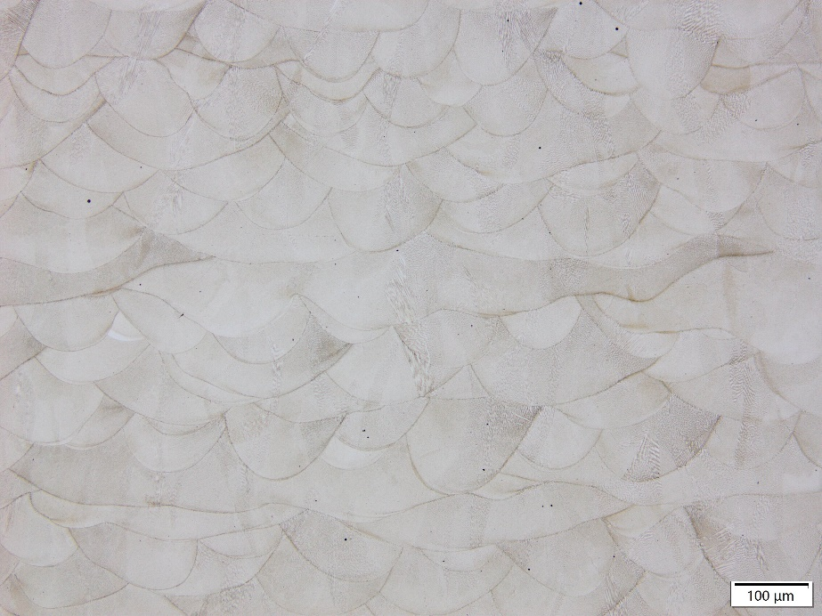
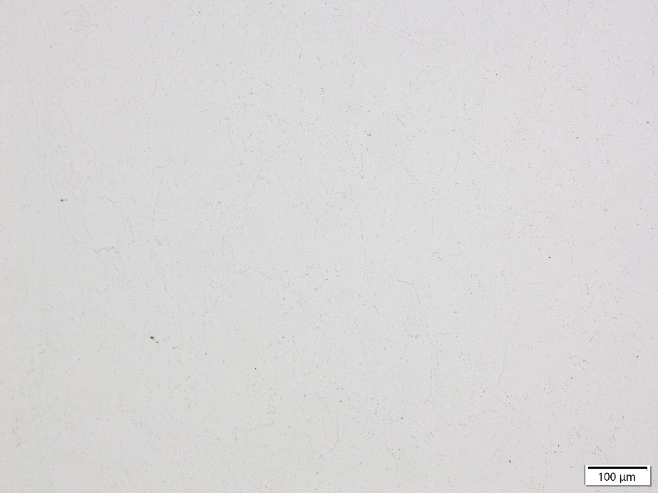

GH3625金属粉末

## 介绍

GH3625是一款以钼铌为主要强化元素的固溶强化型镍基奥氏体高温合金。化学成分与美宇航标准AMS 5666、美标ASTM B446 UNS N06625、GB/T14992-2005、In625接近。

## 性能

优异的抗腐蚀性。对氧化和还原环境的各种腐蚀介质都具有非常出色的抗腐蚀能力。
从低温到982℃时具有良好的机械性能。因此，可广泛用于制造航空发动机零部件、宇航结构部件。
合金在550～700℃长期使用后有一定的时效硬化现象，导致合金塑性有一些下降，但依然能够保持较好的强度和塑性平衡，适应长期工作条件。
从低温到982℃时具有高抗氧化性
良好的成形与焊接性能

## 典型应用

航空发动机（机匣、导向叶片、安装边、筒体、燃油总管等）
航天器（结构部件、发动机喷嘴、机翼等）
工业设备（反应炉管、热交换器、炉衬等）
压力容器
水下用紧固件

| 物性 |  |  |
| --- | --- | --- |
| 熔点 | 1290℃(s)~1350℃(l) |  |
| 理论致密密度 | 8.4g/cm3 |  |
| 形貌 | 球形 |  |
| 应用工艺 | 粉末床熔融 定向能量沉积 热喷涂 |  |

## 材料数据

化学成分范围（质量分数，wt%）

| Ni | Cr | Mo | Fe | Nb | Co |
| --- | --- | --- | --- | --- | --- |
| 余量 | 20.00~23.00 | 8.00~10.00 | ≤5.00 | 3.15~4.15 | ≤1.00 |
| C | Al | Ti | Si | Mn | P |
| ≤0.10 | ≤0.40 | ≤0.40 | ≤0.50 | ≤0.50 | ≤0.015 |
| S | Cu | O | N |  |  |
| ≤0.015 | ≤0.070 | ≤0.015 | ≤0.005 |  |  |

成分可以定制

粒度分布、松装密度、流动性

| 规格 | D10 （μm） | D50 （μm） | D90 （μm） | 松装密度（g/cm3） | 霍尔流速（s/50g） |
| --- | --- | --- | --- | --- | --- |
| 15~53μm | 16-22 | 30-40 | 54-60 | >4.3 | &lt;15 |
| 20~63μm | 16-22 | 30-40 | 62-68 | >4.3 | &lt;15 |

规格可以定制

## 成形性能

测试粉末规格：15~53μm
测试机型及参数：易加EP-M300，50μm层厚
热处理： 固溶处理（4h升温至1080℃保温1h后气冷）

## 力学性能

| 类别 | 常温拉伸（25℃） | 高温拉伸（815℃） | 高温持久*（815℃） |  |  |  |  |  |  |
| --- | --- | --- | --- | --- | --- | --- | --- | --- | --- |
|  | 屈服强度（MPa） | 抗拉强度（MPa） | 延伸率（%） | 屈服强度（MPa） | 抗拉强度（MPa） | 延伸率（%） | 持续时间（h） | 延伸率（%） |  |
| 常规标准 | ≥410 | ≥830 | ≥30 | ≥180 | ≥300 | ≥35 | ≥23 | ≥15 |  |
| 有朋GH3625 | 横向 | 488 | 939 | 52.4 | 316 | 419 | 52 | 59 | 32 |
|  | 纵向 | 513 | 870 | 54.4 | 324 | 407 | 78.4 | 60 | 42 |

*高温持久测试条件为114MPa/815℃恒温恒力加载，48h后每隔10h增加35MPa至断

金相显微组织

## 打印态

## 热处理后

## 商务信息

## 包装交期

| 规格 | 标准包装* | 交期 |
| --- | --- | --- |
| 15~53μm | 20KG塑料桶 | 现货 |
| 20~63μm | 20KG塑料桶 | 现货 |

