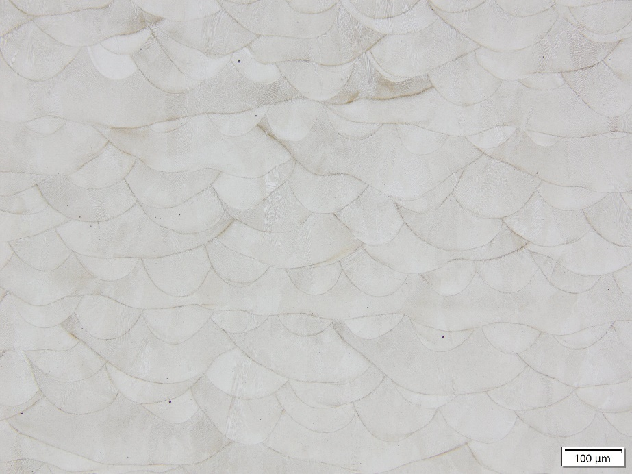
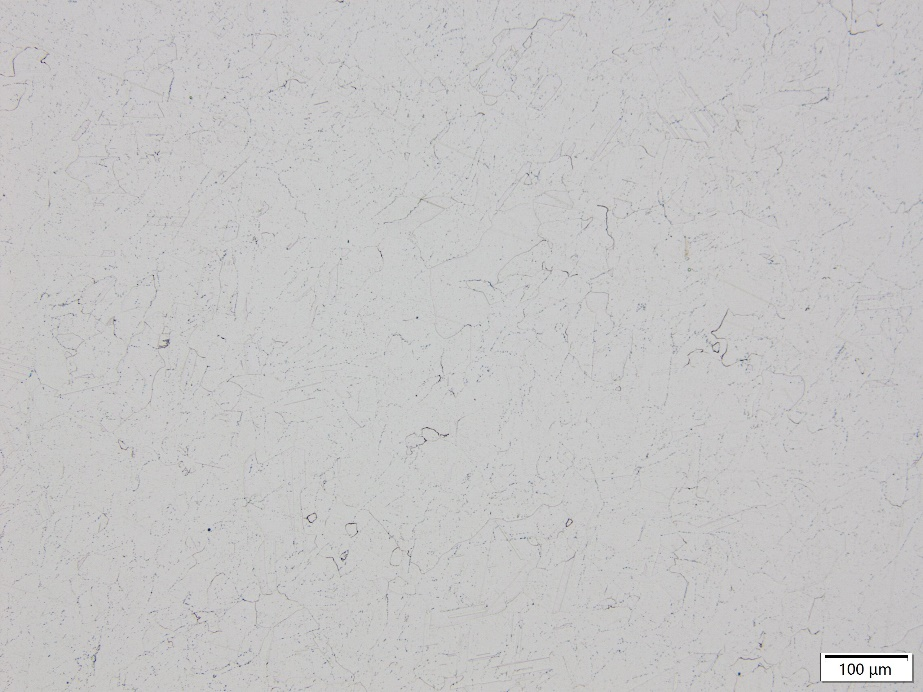

GH4169金属粉末

## 介绍

GH4169是一款以体心四方的γ′′和面心立方的γ′相沉淀强化的镍基高温合金，化学成分与美宇航标准AMS 5662、美标ASTM B637 UNS N07718、GB/T14992-2005、In 718接近。

## 性能

在-253℃到700℃温度范围内时具有良好的综合性能，650℃以下的屈服强度在变形高温合金中最好
良好的抗疲劳、抗辐射、抗氧化、耐腐蚀性能
良好的加工性能、焊接性能和长期组织稳定性
低温下稳定的化学性能

## 典型应用

航空航天（发动机零件等）
燃气轮机（叶片等）
油气工程（传感器等）
酸性环境
核工程
低温工程（火箭液氮储存器等）

| 物性 |  |  |
| --- | --- | --- |
| 熔点 | 1260℃(s)~1340℃(l) |  |
| 理论致密密度 | 8.24g/cm3 |  |
| 形貌 | 球形 |  |
| 应用工艺 | 粉末床熔融 定向能量沉积 热喷涂 |  |

## 材料数据

化学成分范围（质量分数，wt%）

| Ni | Cr | Fe | Nb | Mo | Al |
| --- | --- | --- | --- | --- | --- |
| 50.00~55.00 | 17.00~21.00 | 余量 | 4.75~5.50 | 2.80~3.30 | 0.20~0.80 |
| Ti | C | Co | Mg | B | Si |
| 0.65~1.15 | ≤0.08 | ≤1.00 | ≤0.010 | ≤0.006 | ≤0.35 |
| Mn | P | S | Cu | O | N |
| ≤0.35 | ≤0.015 | ≤0.015 | ≤0.300 | ≤0.015 | ≤0.005 |

成分可以定制
粒度分布、松装密度、流动性

| 规格 | D10 （μm） | D50 （μm） | D90 （μm） | 松装密度（g/cm3） | 霍尔流速（s/50g） |
| --- | --- | --- | --- | --- | --- |
| 15~53μm | 16-22 | 30-40 | 54-60 | ≥4.3 | &lt;15 |
| 20~63μm | 16-22 | 30-40 | 62-68 | ≥4.4 | &lt;15 |

规格可以定制

## 成形性能

测试粉末规格：15~53μm
测试机型及参数：易加EP-M300，50μm层厚
热处理： 固溶处理（4h升温至1110℃保温1h后气冷）+时效处理（3h升温至740℃保温8h后2h炉冷至640℃保温8h后空冷）

## 力学性能

| 类别 | 常温拉伸（25℃） | 高温拉伸（650℃） | 高温持久*（650℃） |  |  |  |  |  |  |
| --- | --- | --- | --- | --- | --- | --- | --- | --- | --- |
|  | 屈服强度（MPa） | 抗拉强度（MPa） | 延伸率（%） | 屈服强度（MPa） | 抗拉强度（MPa） | 延伸率（%） | 持续时间（h） | 延伸率（%） |  |
| 常规标准 | ≥1035 | ≥1275 | ≥12 | ≥860 | ≥1000 | ≥12 | ≥23 | ≥3 |  |
| 有朋GH4169 | 横向 | 1171 | 1389 | 24.8 | 920 | 1108 | 33.6 | 81.2 | 5.2 |
|  | 纵向 | 1166 | 1373 | 25.2 | 949 | 1105 | 33.6 | 83.2 | 6.7 |

*高温持久测试条件为685MPa/650℃恒温恒力加载，48h后每隔8h增加35MPa至断

## 金相组织

## 打印态

## 热处理后

## 商务信息

## 包装交期

| 规格 | 标准包装* | 交期 |
| --- | --- | --- |
| 15~53μm | 20KG塑料桶 | 现货 |
| 20~63μm | 20KG塑料桶 | 现货 |

*大批量采购可