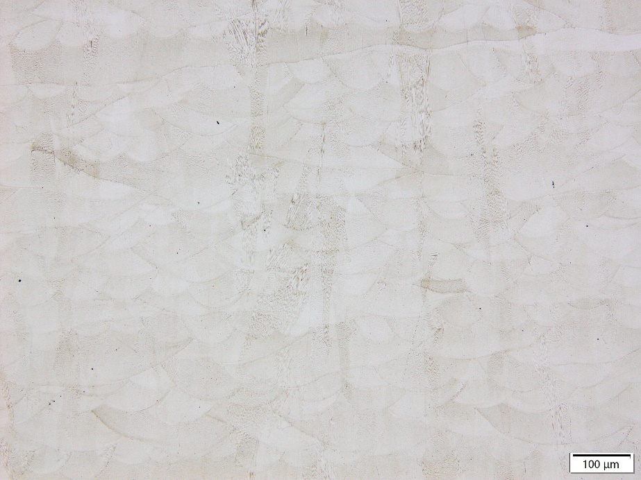

GH5188金属粉末

## 介绍

GH5188是一款以W为主要强化元素的固溶强化型钴基奥氏体高温合金。化学成分与美宇航标准AMS 5608（板材）/AMS 5772（棒材）、美标UNS R30188、GB/T14992-2005、Haynes 188接近。

## 性能

优秀的抗蠕变性能。在高温、高压、高负荷的工况下，能在长时间的高温作用下保持较小的变形量。
优异的抗腐蚀性。铬、钨等元素能形成致密的氧化物保护膜，极大地增强了其在高温下的抗氧化能力，可在高温氧化环境中长时间稳定工作。
高温强度更高。在 1000℃至 1200℃的高温区间，GH5188 合金能够有效抑制材料的蠕变和变形，能更好地保持较高的抗拉强度和屈服强度，满足高温环境下对结构稳定性的需求。

## 典型应用

航天航空发动机（燃烧室部件、涡轮叶片等）
工业燃气轮机（燃烧室、透平等）
电子领域（电子封装等）

| 物性 |  |  |
| --- | --- | --- |
| 熔点 | 1300℃(s)~1360℃(l) |  |
| 理论致密密度 | 9.1g/cm3 |  |
| 形貌 | 球形 |  |
| 应用工艺 | 粉末床熔融 定向能量沉积 热喷涂 |  |

## 材料数据

化学成分范围（质量分数，wt%）

| Co | Cr | Ni | W | Fe | La |
| --- | --- | --- | --- | --- | --- |
| 余量 | 20.00~24.00 | 20.00~24.00 | 13.00~16.00 | ≤3.00 | 0.030~0.120 |
| C | Si | Mn | P | S | Cu |
| 0.05~0.15 | 0.20~0.50 | ≤1.25 | ≤0.020 | ≤0.015 | ≤0.070 |
| B | O | N |  |  |  |
| ≤0.015 | ≤0.015 | ≤0.005 |  |  |  |

成分可以定制
粒度分布、松装密度、流动性

| 规格 | D10 （μm） | D50 （μm） | D90 （μm） | 松装密度（g/cm3） | 霍尔流速（s/50g） |
| --- | --- | --- | --- | --- | --- |
| 15~53μm | 16-22 | 30-40 | 54-60 | >4.8 | &lt;15 |
| 20~63μm | 16-22 | 30-40 | 62-68 | ＞5.5 | ＜15 |

规格可以定制

## 成形性能

测试粉末规格：15~53μm
测试机型及参数：EP-M300，40μm层厚
热处理： 热等静压处理（5h升温至1175℃，压力160±5MPa，保温3h后炉冷）+固溶处理（4h升温至1180℃，保温1h，气冷）

## 力学性能

| 类别 | 常温拉伸（25℃） | 高温拉伸（980℃） | 高温持久*（927℃） |  |  |  |  |  |  |
| --- | --- | --- | --- | --- | --- | --- | --- | --- | --- |
|  | 屈服强度（MPa） | 抗拉强度（MPa） | 延伸率（%） | 屈服强度（MPa） | 抗拉强度（MPa） | 延伸率（%） | 持续时间（h） | 延伸率（%） |  |
| 常规标准 | ≥400 | ≥760 | ≥30 | ≥140 | ≥180 | ≥15 | ≥23 | ≥15 |  |
| 有朋GH5188 | 横向 | 563 | 972 | 51.6 | 175 | 239 | 47.6 | 35 | 48.2 |
|  | 纵向 | 501 | 825 | 64.0 | 162 | 217 | 84.0 | 34 | 66.4 |

*高温持久测试条件为90MPa/927℃恒温恒力加载，23h后每隔10h增加35MPa至断

金相显微组织

## 打印态

## 热处理后

## 商务信息

## 包装交期

| 规格 | 标准包装* | 交期 |
| --- | --- | --- |
| 15~53μm | 20KG塑料桶 | 现货 |
| 20~63μm | 20KG塑料桶 | 现货 |

*大批量采购可定制包装
